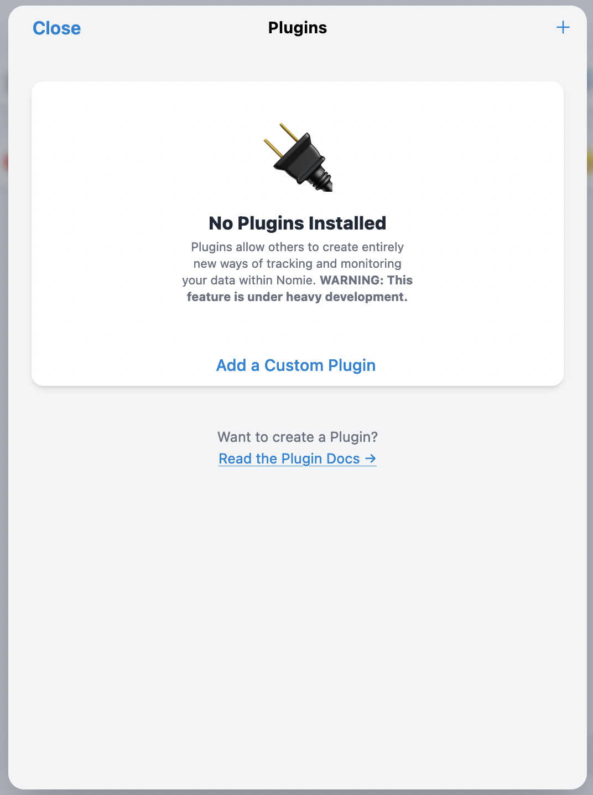
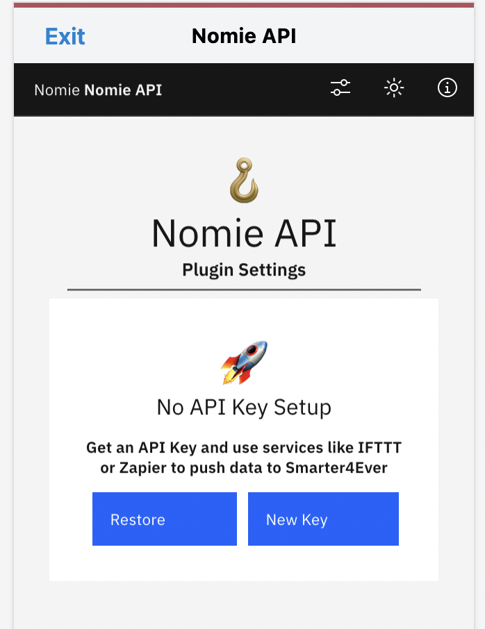
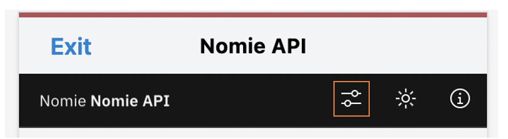
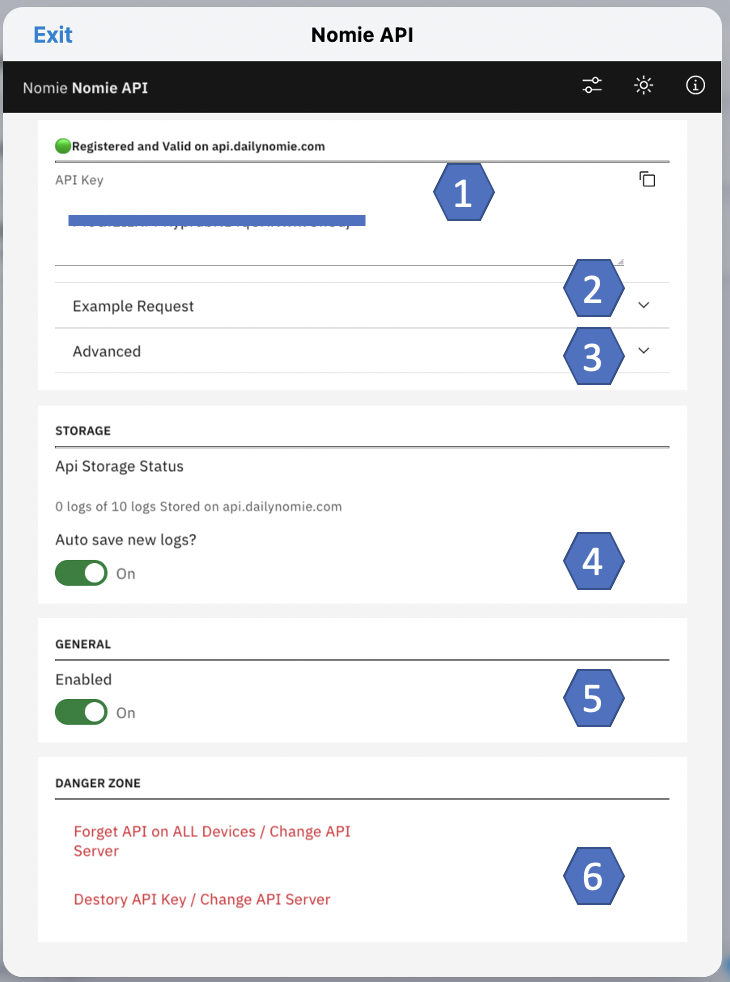
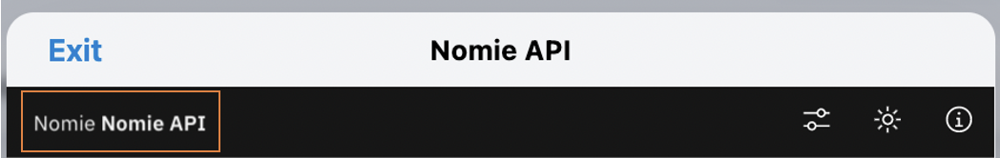
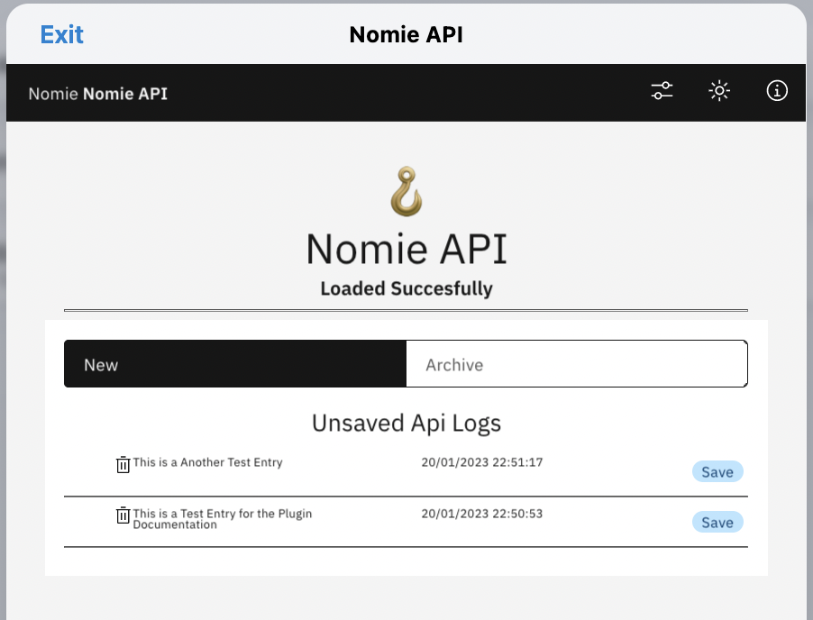
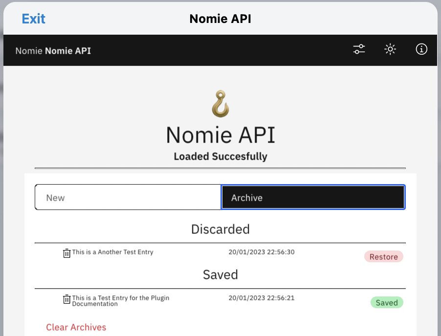
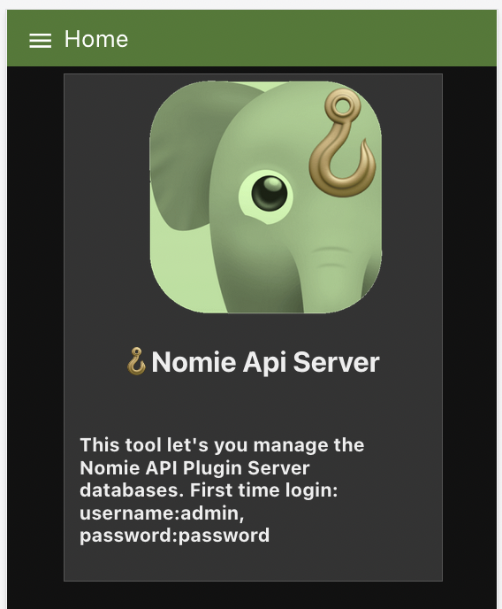
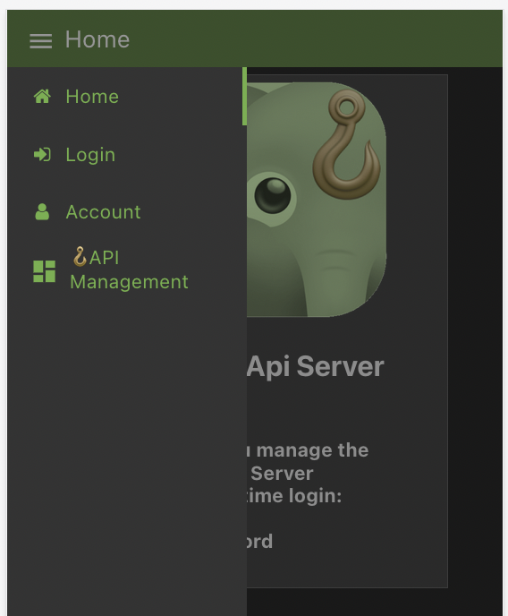
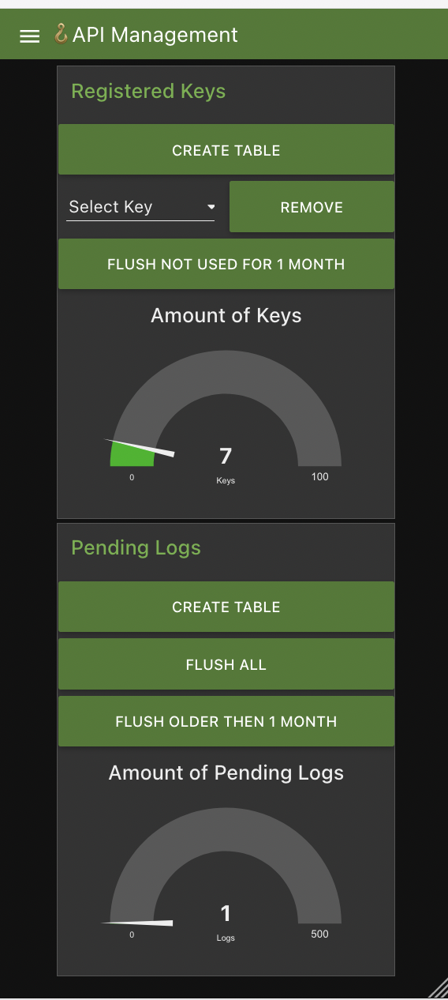

# 🪝Nomie Api Plugin

The 🪝Nomie Api Plugin is a plugin for Nomie6-oss.

## About the 🪝Nomie API Plugin

The Nomie API plugin allows you to push data notes into Nomie, for example importing your sleep data using [IFTTT](https://ifttt.com) or [Zapier](https://zapier.com).

The 🪝Nomie API plugin acts as a client between a Nomie API Server and the Nomie app.

The Nomie API server should be installed seperately. Instructions can be found via the following link:

*-will be available soon-*

API calls are not sent directly to the device. Instead, each note sent through the API is encrypted with your public key and held in a slot on the API Server until Nomie on your device can import and decrypt it. That slot will be freed up once Nomie pulls the note down.

## Installing the Plugin

The url of the plugin is:

[https://dailynomie.github.io/api-plugin/](https://dailynomie.github.io/api-plugin/)

The 🪝Nomie API Plugin can be installed in Nomie via the following steps:

* Go to the More Tab
* Select Plugins
* Click the + or Add Custom Plugin
* Provide the url for the plugin
* Tap Install Plugin



## Configuring the Plugin

After installing the plugin, please open the plugin and you will be prompted to generate a new api key on an api server. Alternatively -if you already have an api key from a previous configuration- you can restore that key.



### Generating a new key

Click on the New Key button and you will be prompted to provide the domain of your api server. You only have to provide the domain of your server (so without the https://). preferably you will host your own server, for convenience I have enabled a server which I only support on best effort: api.dailynomie.com

After your key is generated, you are ready to receive notes/logs.

### Restore a key

If you previously acquired a key and you want to restore that on your device, you can do that by clicking on the Restore Key button.

in order to do so you need to provide the following information:

* the domain of the server your previous key was acquired from
* your previous api key
* your previous private key

Only the combination of above information will enable a restore, so please make sure to keep these details after you have been provided with an api key.

## Sending Data to the Api

Preferably you wil host your own Nomie Api Server (and as such have your own url), but for convenience I have made a server available which I will support on best effort only.

* **URL** :[https://api.dailynomie.com/log](https://api.dailynomie.com/log)
* **METHOD** : POST
* **BODY** : application/jso

### Available payload properties:

**note** : **(required)** string  - the data note containing #your +tags and stuff

key: **(required)** string - your API key

**created** : Date - a javascript compliant date string

**location** : Name of the location

**lat** : latitude

**lng** : longitude

**score** : number

```javascript
{
	"note": "I'm tracking daaaata! #mood(5) #sleep(05:54:34)",
	"created": "2023-01-20T15:57:44.123Z",
	"lat": 37.81,
	"lng": -81.63,
	"location": "Planet Earth"
	"key": "123456789123456789234567789"
}
```

## The Plugin Settings

After succesfully registering an api key you will be able to further configure some settings. When setting up the plugin for the first time, you will be directed to the settings page automatically. Otherwise you can access the settings page by clicking on the settings icon in the menu:



You will be directed to the following screen:



1. Your Api Key (you need this key to send logs/notes to Nomie)
2. An example request. This will show you an example request which you can send to the api.
3. Advanced. By expanding the advanced section you can copy your private key. You need your private key to restore your api (for example on an other device)
4. Auto save new logs. Everytime data is send to the api, your data is stored (in an encrypted slot) on the server. When you open the Nomie app on your device, Nomie will pull the data from the server and empty the related server slots. When autosave is enabled, Nomie will automatically save the pulled data into Nomie log/note entries. When autosave is disabled, Nomie will hold the data untill you will manually authorise each pulled slot to flow into  Nomie as a log/note.
5. Toggle to switch the API functionality on and off. When disables, Nomie will NOT reach out to the server to pull data slots.
6. You can either remove the current key from the Nomie app, but it will be kept on the server so you can resore it later. You can also fully destroy your key  on both the client and the server. You api key will be gone...forever 😄

## New Entries and Archive

When configured and enabled, the default startpage for the plugin is the inbox/archive section. This section can also be reached from other sections by clicking in the left top corner of the plugin:



The New Entries and Archive sections looks as follows:



### New Entries

In above example I have just send over 2 entries via the api. Autosave is set to off, so you can manually decide what to do with the entrie. You can either delete the entry by clicking on the bin icon, or you can save the entry.

### Archive

From above example i have deleted one item and saved the other item. Both items will be stored in the archive....so you can repair any mistakes you made😄:



For the delted/discarded entries, you have the option to restore them. When completely confident, you can clear the full archive.

# 🪝Nomie API Server

In order to enable the API capability, a server is needed to store the entries send to the api until the Nomie app on your device pulled the data into Nomie.

As Nomie is fully Open Source and aimed for self hosting, you should preferably setup your own little private API server.

In the mean time -as stated above- you can try to use api.dailynomie.com as your api server. It is hosted by me, on best effort and as long as it can cope with the load.

## Installing the server

My instantiation of the server is build with Node Red and can be deployed in many ways. You can find the source code at:

-to be included once available for sharing-

The most easy way of deploying the server is via a docker container. It can -for instance- be hosted on your Synology Nas.

The Docker image is available at:[https://hub.docker.com/repository/docker/rdelange/dailynomie-apiserver/](https://hub.docker.com/repository/docker/rdelange/dailynomie-apiserver/https:/)

An example of deployment stack is as follows:

```javascript
version: '3'
services:
 s4eapiserver:
  image: rdelange/dailynomie-apiserver:latest
  container_name: dailynomie-apiserver-docker
  volumes:
   - /volume1/docker/nomieapiserver:/home
  ports:
      - "1440:1880"

```

where the volumes line points to a directory on your server to persist data.

## Using the Server

You can reach the server GUI by using your domain, followed by /ui (example: hhps://api.mydomain.com/ui)

You will be provided with the following screen:



The default login codes are given in above introduction screen, please change them immediately to prevent easy login by others.....

### Change your credentials

You can chage your credentials by logging in with the default credentials via the Log In option at the menu at the left top corner:



Once you have changed your credentials and logged on again with your new password, you can enter the server dashboard by choosing the API Management option in the menu.

### The API Server Dashboard

The API server dashboard consists of 2 sections:

* Managing the registered keys
* Managing the pending logs




For both sections you have the option to create the backend database table. When everything is running fine you should not have to use this option as the databases are automatically setup when the server is deployed.

You can remove individual keys or flush all keys which are not used for longer then a month.

For the pending logs you have the option to flush them all or only the logs older then a Month.

In the future I might add some additional management options, but as the server is intended to be self hosted for your / your families / your friends installed Nomie apps, these simple options should be enough.

### Managing accounts

If you want to co-manage the server with somebody else, you have the option to give other users access to the server. You can do this via the account section in the menu.

Please be aware that this is a very simple implementation of account management. It works, but as this server is intended to be privately hosted with limitted usage and workload it is not likely that this section will be further developped in the future.

### Why Node-Red

I mentioned above that this server is build using Node-Red. I am fully aware that there are much better ways of implementing the same functionality, but I like to experiment and learn...and this was one of these journies.

Have fun with it!
